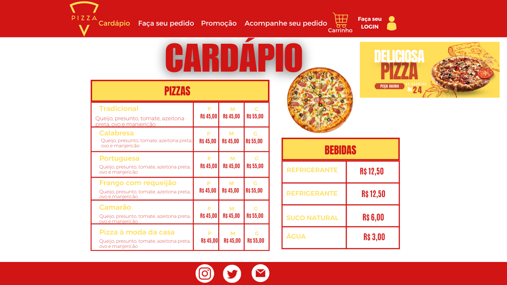

<h1 align="center">

PROJETO: PAGE PIZZARIA - FRONT-END - RESPONSIVIDADE 

  
    
    
      
      

</h1>

<h3>Tela desenvolvida visão desktop </h3>

  
    
    
      
      

<h3>Tela desenvolvida visão mobile </h3>

  
    
    
      
      
